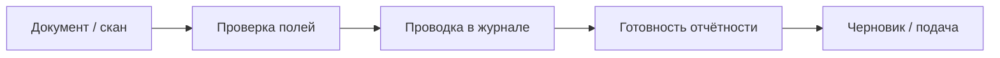

# FinClick — Financial OS UX Audit (2026-05)

Аудитор: product/UX/engineering slice поверх текущего кода (`frontend/web`, `backend/api-gateway`).  
Цель: не переписать ERP, а сделать **единую execution-first операционную систему** для Беларуси.

---

## Executive summary

| Оценка | Комментарий |
|--------|-------------|
| **Backend / домен** | Сильный: Financial State, execution feed, work packs, OCR pipeline, inbox/approvals, RB chart. |
| **Frontend / cohesion** | Средний+: IA уже NOW/MONEY/REPORTING/TEAM/CONTROL, но экраны всё ещё ощущаются как **модули**, не как один поток. |
| **Главный разрыв** | Нет **одного непрерывного narrative**: «состояние → внимание → действие → что дальше» на каждом шаге цепочки документ→журнал→отчёт. |

После волн W1–F1/TD пользователь **ближе** к целевому ощущению, но hub учёта, дубли hero, EN/copy-хвосты и «плиточный» UX всё ещё создают cognitive load.

---

## Принципы (чеклист экрана)

Каждый экран должен отвечать минимум на один вопрос:

1. Каково **состояние** бизнеса? → `FinancialStateHero` / 4 уровня риска  
2. Что **требует внимания**? → execution feed, inbox, OCR queue, blockers  
3. Что **блокирует** отчётность? → reporting readiness, compliance  
4. Что система **сделает сама**? → autopilot / work packs (копирайт: «пакет задач»)  
5. Что будет, если **отложить**? → `risk_if_ignored`, calm copy  

Если экран только «список сущностей» без ответа — **плохой экран**.

---

## IA (целевая vs факт)

| Группа | Маршруты | Статус |
|--------|----------|--------|
| **Сейчас** | `/`, `/operations`, `/inbox`, `/approvals` | ✅ navConfig |
| **Деньги** | hub, journal, bank, documents, counterparties, chart, FA, scan | ✅ flyout; hub **перерабатывается** (P4) |
| **Отчётность** | `/reports`, calendar, employees | ✅ guided flow |
| **Команда** | `/workspace`, `/workspace/queues`, planner, employees | ✅ accountant overview |
| **Контроль** | state, trust, analytics, settings | ✅ |

**Риск IA:** «Сотрудники» в двух группах (отчётность flyout + команда) — оставить один canonical path, второй — flyout-ссылка.

**Mobile bar:** Главная · Лента · Входящие · Учёт — OK для owner/accountant; manager — scan-first.

---

## Findings by area

### Sidebar / navigation
| Проблема | Влияние | Рекомендация |
|----------|---------|--------------|
| Flyout скрывает журнал/скан за одним пунктом «Учёт» | Бухгалтер ищет журнал лишним кликом | Hub = приоритеты; journal = primary CTA везде |
| Нет визуального «где я в потоке» | Разрыв OCR↔журнал↔отчёт | Continuity panel + ladder (✅ F1c); усилить на hub/journal |
| Control свёрнут в один пункт | OK для calm, но analytics редко находят | Оставить; не раздувать sidebar |

### Dashboard `/`
| Проблема | Влияние | Рекомендация |
|----------|---------|--------------|
| WorkNow + Hero + charts = три центра внимания | Cognitive overload | Charts collapsible (✅); один hero + one next action |
| Метрики без «что делать» | Декоративность | Привязать метрики к CTA в ленту/учёт |

### Operations `/operations`
| Сильно | Слабо |
|--------|-------|
| Execution feed, work packs, grouped types | Diagnostics/admin блоки для non-admin — OK hidden |
| | Copy «пакет работ» → **пакет задач** |
| | `ai_summary` может звучать как hype — см. Phase 10 |

### Accounting hub `/accounting/hub`
| Проблема | Влияние |
|----------|---------|
| 7 равнозначных плиток | Модульный ERP-вид, нет приоритетов |
| Статический FocusStrip | Не отражает очереди OCR/черновиков |
| Нет Financial State | Разрыв с главной и лентой |

**→ P4 implementation в этом коммите**

### Journal `/accounting/journal`
| Сильно | Слабо |
|--------|-------|
| Hotkeys, bulk post, session filters, side panel | Визуально тяжёлый card shell |
| | Нет compact Financial State в шапке потока |
| | Split view / timeline — backlog P5 |

### Scanner `/scan`
| Сильно | Слабо |
|--------|-------|
| Queue, overlay, autosave, batch | Post-confirm: invalidation calm overview + % готовности ✅ |
| | Пакетная загрузка: сводка + CTA в очередь проверки ✅ |

### Reporting `/reports`
| Сильно | Слабо |
|--------|-------|
| Guided flow, readiness hero, sticky mobile actions | EN codes в snapshot — частично RU (✅ labels) |
| | Period close narrative — ✅ P7 (`ReportingPeriodNarrative`, шаги гида) |

### Workspace `/workspace`
| Сильно | Слабо |
|--------|-------|
| Overview sort by workload, queues, pin | Нет единого календаря дедлайнов по клиентам (P6) |
| | OCR count per client на overview — опционально API |

### Design system
| Проблема | Рекомендация |
|----------|--------------|
| `page-section` vs `fc-execution-card` vs `card-elevated` | Документировать 3 уровня поверхностей в `index.css` / design tokens |
| Слишком много primary buttons на странице | Правило: **1 primary** на viewport |
| Glow / ring inconsistent | Phase 8: audit `shadow-glow` usage |

### Mobile
| Done | Backlog |
|------|---------|
| Sticky reporting actions, journal bulk bar, continuity drawer, swipe→провести (mobile), OCR full-screen (P9) | — |

### Copy / trust
| Убрать | Использовать |
|--------|--------------|
| Business OS, Operational health (UI) | Состояние бизнеса, Требует внимания |
| Work pack (UI) | Пакет задач |
| Smart Capture | Умный захват (✅) |
| Error / invalid (голые) | Спокойные причины + действие |

Источник правды: `frontend/web/src/i18n/terminology.ru.ts`.

---

## Global Financial State (Phase 2)

**Уже есть:** `FinancialStateHero` + API `GET /operations/financial-state`.

**4 уровня (UI):**
- Норма (`low`)
- Нужны действия (`medium`)
- Есть риск (`high`)
- Критично (`critical`)

**Где должен жить слой (target):**

| Экран | Вариант |
|-------|---------|
| Главная | Full hero |
| Лента | Compact hero |
| Hub учёта | Full hero + priority queue |
| Журнал | Compact strip |
| Сканер | Compact + queue strip |
| Отчётность | В guided flow snapshot |
| Workspace | Per-client readiness (overview API) |

---

## Continuous flow (Phase 3)

**Реализовано:** operational session, flow ladder, `doc_id`, bulk→reports, next step.  
**Осталось:** после confirm OCR — invalidate `reporting-calm-overview` + toast «готовность X%»; batch confirm UX; keyboard Tab chain polish.

---

## Architecture-safe implementation plan

| Phase | Scope | Backend | Frontend | Risk |
|-------|--------|---------|----------|------|
| **P4** | Accounting hub → command center | Reuse financial-state, scanner queue | Hub priorities component | Low |
| **P5** | Journal calm + keyboard-first | Done | Split, inline post, P hotkey, panel restore, calm capture |
| **P6** | Workspace mission control | Extend overview optional fields | Grouped deadlines UI | Done |
| **P7** | Reporting period narrative | Existing calm API | Copy + step labels | Done |
| **P8** | Design tokens cohesion | — | CSS + component audit | Done |
| **P9** | Mobile OCR/journal | — | Layout only | Done |
| **P10** | Trust copy | — | terminology.ru enforcement | Done |
| **P11** | Главная = Financial OS Home | Reuse financial-state predictions + bank balance | Hero деньги/прогноз, 5 блоков, Timeline | Done |

**Не делаем:** новые сущности БД, rewrite App, смена framework.

---

## Migration notes

- Маршруты **не меняются** — bookmarks сохраняются.
- `fc-reporting-flow-step` → org-scoped keys (✅ TD1).
- Старые глобальные session keys читаются один раз при миграции.
- Роль `manager` — урезанное меню без изменений.

---

## Removed friction (cumulative)

- ERP-лабиринт → 5 групп nav  
- Journal спрятан → hub + flyout + mobile «Учёт»  
- Пустые inbox/approvals → CTA  
- OCR queue как метрика → очередь + авто-ход  
- Reporting duplicate UI → один guided flow  
- Org switch без контекста → session + recent clients  
- EN баннеры событий → RU labels  
- Модульный hub → **operational priorities (P4)**  

---

## Improved workflows (cumulative)

- Execution-first лента с why/risk/confidence  
- OCR → journal deep link → reporting next step  
- Bulk post журнала  
- Multi-client queues + pin  
- Operational comments на задачах  
- Flow ladder в continuity panel  

---

## Simplified interactions (target)

- **1 primary action** per screen (enforced in hub/journal/reporting)  
- **1 next step** via operational session  
- **Fewer equal tiles** → prioritized list  

---

## Next commits (recommended order)

1. ✅ P4 Hub + terminology «пакет задач» + hero on journal/scan  
2. ✅ P5 Journal: split panel, timeline, issues filter, inline post, pipeline badges  
3. ✅ P8 `DESIGN_TOKENS.md` + fc-surface-* на учёте/отчётности/execution  
4. ✅ P6 Workspace: `deadlines`, `totals`, OCR per client, `WorkspaceMissionPanel`
5. ✅ P10 `apiLabels.ru` + `calmActionError`; RU trust/execution/reporting copy  
6. ✅ TD4 continuous flow + полный calm i18n + nav/session cleanup  
7. ✅ P11 Главная: hero деньги+прогноз; 5 блоков; `DashboardTimeline`; ExecutiveBriefing/налоги в «Подробнее»
